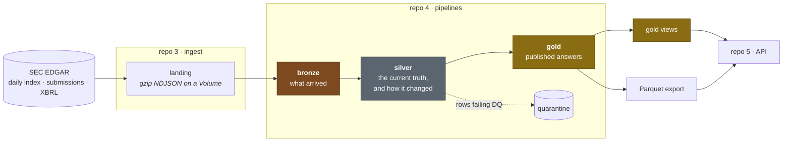
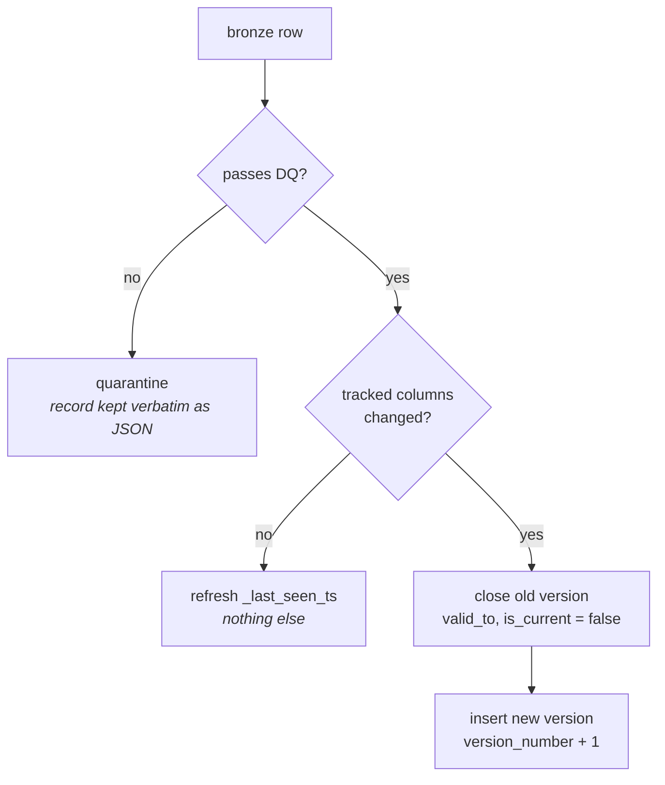
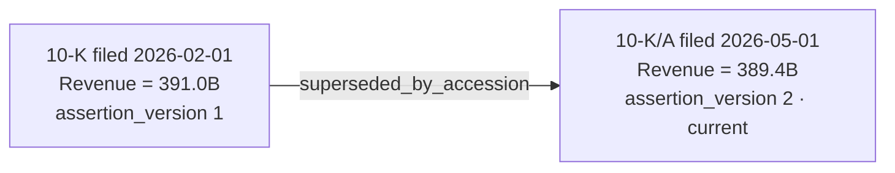
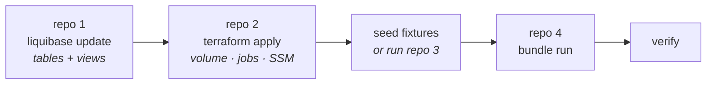

# The EDGAR medallion pipelines

How data moves from an SEC filing to a queryable answer, what each layer is responsible
for, and how to run the whole thing against a small committed slice of real data.

Design detail lives in [`docs/00-design-doc.md`](docs/00-design-doc.md); the layer
signature and versioning model in
[`docs/05-layer-signature-and-versioning.md`](docs/05-layer-signature-and-versioning.md).

---

## 1. The shape of it



The one-directional rule: **each layer reads only the layer before it.** Gold never
reads bronze, silver never reads landing. A shortcut across two layers is how a
transformation ends up implemented twice and the copies drift.

---

## 2. What each layer is for

The layers are not a naming convention — each has a **signature**, a set of audit columns
it must carry and must not borrow from another. `tests/test_layer_signature.py` enforces
it, so a table drifting out of its layer is a failing test rather than something a
reviewer has to spot.

### Bronze — *what arrived, and from where*

Append-only. Never deduped, never typed, never corrected.

| column | why |
|---|---|
| `_ingest_batch_id` | repo 3's deterministic batch id |
| `_ingest_ts` | when this pipeline wrote the row |
| `_source_file` | which landing object it came from |
| `_source_system` | `sec_edgar` |
| `_envelope_version` | *read*, not assumed — an unknown version fails loudly |
| `_rescued_data` | Auto Loader's catch-all for fields it didn't expect |

Payloads stay opaque (`payload_json` as a string) for two of the three streams. The SEC
changes those documents' shape without notice; parsing at bronze would couple the raw
layer to a shape we don't control and destroy replay.

> `_rescued_data` is not decoration. Auto Loader routes unrecognised fields there instead
> of failing — which is exactly how an earlier envelope mismatch produced a bronze table
> of all-NULL rows that looked like a successful run.

### Silver — *the current truth, and how it changed*

Typed, deduped, MERGEd, quarantined on failure. **Nothing is ever overwritten.**



`_first_seen_ts` is written on INSERT and never appears in an UPDATE. Reverse that and
"when did we first see this filing" silently becomes "when did the job last run" — and
nothing fails, so nobody notices until a report is built on it.

### Gold — *a published answer, and which inputs produced it*

Rebuilt, not merged. Every gold table is a pure function of silver at a point in time,
stamped with `_generated_at` and `_run_id`.

---

## 3. Keeping old versions

Three different questions, three different mechanisms. They are not substitutes.

| question | mechanism |
|---|---|
| *What did we believe about this company over time?* | **SCD-2** on `silver.company` / `silver.filing` |
| *Which figure did each filing assert for this period?* | **assertion versioning** on `silver.financial_fact` |
| *What did this table physically contain at version 12?* | **Delta time travel** |

### Dimensions — SCD-2

```
cik        version_number  valid_from   valid_to    is_current  company_name
0000320193 1               2026-07-29   2026-07-31  false       APPLE COMPUTER INC
0000320193 2               2026-07-31   NULL        true        Apple Inc.
```

Invariants, enforced as `reject_batch` — a violation fans out every downstream join, so
one bad row aborts the batch and rolls the table back:

1. exactly one `is_current` row per natural key
2. no two versions of one key overlap in `[valid_from, valid_to)`
3. `version_number` is dense and 1-based per key

`silver.filing` is SCD-2 for a specific reason: filings get **amended**. It used to
overwrite in place, so when a `10-K/A` superseded a `10-K`, the original's `form_type`
and `primary_doc_url` were destroyed — which is precisely the history
`gold.restatement_event` is built from.

### Facts — assertion versioning

A restatement is a **new assertion about the same period**, not a correction to a row, so
both are kept:



`fact_sk` identifies the **period**, and deliberately excludes `accession_number` even
though accession is part of the row grain. That asymmetry is the mechanism: rows sharing
a `fact_sk` are the competing assertions, and the difference between them *is* the
restatement.

### Index columns

- **Surrogate keys** (`company_sk`, `filing_sk`, `fact_sk`) are `sha2` of the natural
  key — never identity columns. Delta assigns identity at write time, so a re-run would
  give the same logical rows different keys, breaking idempotency and invalidating any
  key a consumer cached.
- **Liquid clustering**, not `ZORDER`: Free Edition is serverless-only, where `ZORDER`
  isn't available.

---

## 4. The views

Owned by Liquibase in repo 1 — this repo never issues `CREATE VIEW`.

| view | answers |
|---|---|
| `v_company_current` | current row per company |
| `v_filing_current` | current version per filing |
| `v_financials_latest` | current assertion per fact — restated figures excluded |
| `v_restatement_history` | original vs restated, side by side |
| `v_company_timeline` | every version per company, with the previous value alongside |
| `v_pipeline_health` | row counts, freshness, max version per table |

---

## 5. Running it

### Locally — no Databricks, no network

```bash
make fetch-test-data     # once: pulls a small real slice from the SEC
make local-pipeline      # landing -> bronze -> silver -> gold on local Spark + Delta
```

`data/landing/` is a committed slice of **real** EDGAR output, including a deliberate
schema-drift fixture (`part-00001-drift.json`) so the rescue path is exercised rather
than assumed.

### On Databricks — the same fixtures, the real runtime

Local Spark reads `data/landing/` straight off disk. Databricks can't see your laptop,
so the fixtures have to be uploaded first — re-encoded into exactly the form repo 3
would have written:

```bash
export DATABRICKS_HOST=<DBX_HOST>      # SSM /edgar-lakehouse/dbx/host
export DATABRICKS_TOKEN=<PAT>          # never commit this

python -m tools.dbx_seed_landing --dry-run   # see the plan
python -m tools.dbx_seed_landing             # upload
```

```
5 object(s), 1,302,784 B raw -> 120,619 B gzip
  ok  /Volumes/edgar/landing/edgar/_seed/filing_index/logical_date=2026-07-31/part-00000.json.gz
  ...
```

Then point the pipeline at the seeded prefix and run:

```bash
export EDGAR_LANDING_ROOT=/Volumes/edgar/landing/edgar/_seed
databricks bundle run edgar_pipelines -t dev

python -m tools.dbx_verify               # assert the tables landed as expected
```

Two things the seeder gets deliberately right:

- **gzip with `mtime=0`.** The contract writes `.json.gz`; Spark infers the codec from
  the extension. The pinned `mtime` keeps the bytes identical across runs, which is what
  the project's "run it twice" guarantee depends on.
- **A `_seed/` prefix, not the stream directories.** Landing objects belong to repo 3.
  Seeding over its prefix wouldn't error — it would give you a landing zone where
  fixtures and real filings are indistinguishable. A separate *volume* would be cleaner
  still, but volumes are Terraform's to create.

### Order of operations



Repo 1 first: the pipelines write into tables Liquibase owns, and a missing table should
surface as "changeset 060 was never applied" rather than an `AnalysisException`.

---

## 6. Current status

| | state |
|---|---|
| contracts (repo 1) | **v1.1.0 merged.** Mirror verified: 0 discrepancies across 13 tables + 11 envelope fields |
| DDL applied to workspace | **not yet** — `060`/`070`/`080` are merged but unapplied |
| infra (repo 2) | **not applied.** PR open on `ci/enable-pipeline`; apply runs on merge |
| landing fixtures on Databricks | **seeded** to `/Volumes/edgar/landing/edgar/_seed` |
| bronze/silver/gold code | implemented; SCD-2 and assertion merges are **Spark tests, not yet run** |
| gold `_source_version` | DDL exists, code not written |
