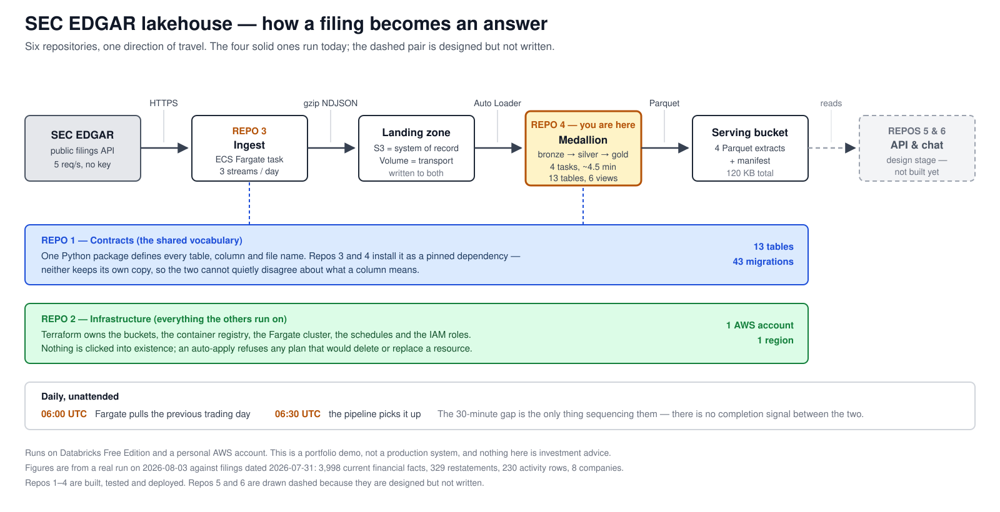

# Turning SEC filings into answers you can trust

## The problem

Public companies file their financial results with the US Securities and Exchange
Commission. Those filings are free and public. They are also messy in one particular way
that breaks most systems built on top of them:

**Companies revise numbers after publishing them.**

A company reports 2024 revenue in February. In August it files an amended report with a
different figure — a reclassification, a correction, an accounting change. Both numbers
were officially filed. Both are real.

Most data pipelines handle this by overwriting the old number with the new one. That
seems reasonable until someone asks a question you can no longer answer:

> *"What did we think this company's revenue was, back when we made that decision in
> March?"*

Once the row is overwritten, that information is gone. You cannot audit a decision
against data that no longer exists.

## What this does differently

This system never overwrites a reported figure. When a company restates, the new figure
is stored **alongside** the old one, and the old one is marked as superseded rather than
deleted.

The practical effect: you can ask both *"what is true now"* and *"what did we believe on
any past date"*, and get a correct answer to each. In the run this repository was last
verified against, **329 restatement events** were detected and preserved. A pipeline that
overwrote rows would have reported zero, silently.

That is the one idea worth taking away. Everything else is plumbing built to support it.

## How the data moves

Five stages, left to right in the picture above.

1. **Collect.** A small container wakes up daily, downloads the day's filing index and
   the underlying financial data from the SEC, and writes it exactly as received. Nothing
   is parsed or cleaned at this stage — the raw response is kept so any later mistake can
   be re-derived rather than re-downloaded.
2. **Land.** Each file is written to two places: cloud storage, which is the permanent
   record, and a Databricks volume, which is the working copy the pipeline reads. If the
   working copy fails, the permanent record still has the data.
3. **Refine.** The data passes through three layers, a common pattern known as
   *medallion*: **bronze** keeps it raw, **silver** cleans and de-duplicates it, **gold**
   shapes it into tables built for answering questions. Rows that fail a quality check are
   not dropped — they are moved to a quarantine table so a human can see what was rejected
   and why.
4. **Publish.** The gold tables are exported to four compact files in cloud storage, plus
   a manifest describing what was produced and when.
5. **Serve.** A public API and a chat interface will read those files. **These two are
   designed but not built** — they are drawn dashed in the diagram for that reason.

## What is actually running

Everything solid in the diagram is deployed and runs on a schedule, unattended:

| | |
|---|---|
| Collection | daily at 06:00 UTC, three data streams |
| Processing | daily at 06:30 UTC, four stages, about four and a half minutes |
| Tables | 13, plus 6 pre-built views |
| Database migrations | 43, all version-controlled |
| Automated tests | 295 across the three Python repositories |
| Cloud resources | defined entirely in code; nothing created by hand |

Figures from the verified run of 2026-08-03, against filings dated 2026-07-31:
3,998 current financial facts, 329 restatement events, 230 daily activity rows,
8 company profiles.

## The engineering idea behind it

Four separate repositories have to agree on exactly what a "filing" is — the same column
names, the same file paths, the same types. The usual way this goes wrong is that each one
keeps its own copy of those definitions, the copies drift apart over months, and nobody
notices until the numbers disagree.

Here, one repository owns those definitions and publishes them as an installable package.
The others depend on a **pinned version** of it. They cannot keep a private copy, so they
cannot drift. An automated check fails the build if any repository's idea of a table stops
matching the published one.

This was not the original design. An earlier version did keep copies, they did drift, and
the drift was invisible for weeks because the check that was supposed to catch it only
compared part of the definition. Removing the copies entirely was the fix.

## Honest limitations

- This is a **portfolio demo**, not a production system.
- It runs on **Databricks Free Edition** and a personal cloud account, which caps how much
  data it can process and shuts compute down daily. The dataset is deliberately small —
  eight companies, not the whole market.
- The serving API and chat interface are **not built yet**.
- Nothing here is investment advice. Fields that classify a figure's significance are
  rules of thumb chosen for the demo, not a financial standard.

## Where to look next

- [`walkthrough.md`](walkthrough.md) — run it yourself, and how to check what it did
- [`architecture.svg`](architecture.svg) — the diagram above, full size
- [`../docs/`](../docs/) — design documents and the reasoning behind each decision
